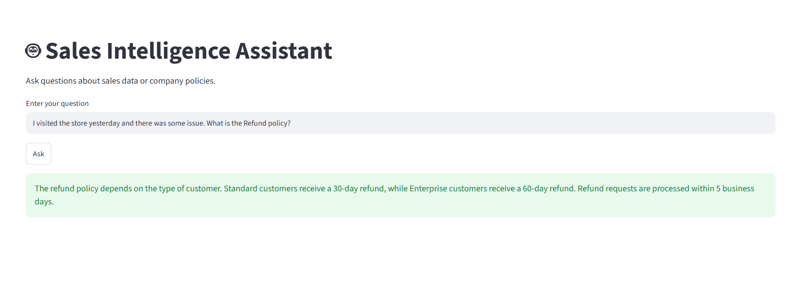
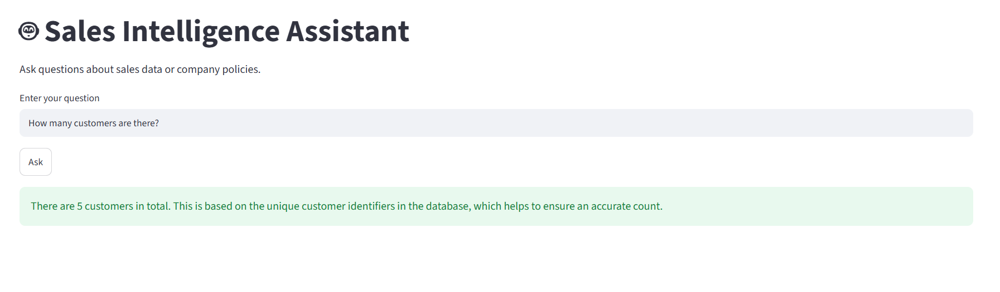

# 🤖 Sales Intelligence Assistant

An AI-powered **Sales Intelligence Assistant** that combines **Text-to-SQL** and **Retrieval-Augmented Generation (RAG)** to answer both structured database queries and unstructured business policy questions.

The assistant intelligently routes user queries to either a **MySQL database** or a **RAG pipeline**, enabling natural language interaction with enterprise sales data and company documents.

---

## 🚀 Features

- 🤖 Natural Language to SQL using LLM
- 📚 Retrieval-Augmented Generation (RAG)
- 🧠 Intelligent Query Routing (SQL vs RAG)
- 🗄️ MySQL Integration
- 🔍 Chroma Vector Database
- 🤗 HuggingFace Embeddings
- ⚡ Groq LLM Integration
- 🌐 Streamlit Web Interface
- 📈 Automatic SQL Result Summarization
- 🛡️ Robust Error Handling
- 🧩 Modular Project Structure

---

# 🏗️ Project Architecture

```text
                    User
                      │
                      ▼
          Streamlit Web Application
                      │
                      ▼
             Intelligent Router
           (SQL or RAG Decision)
              ┌───────────────┐
              │               │
              ▼               ▼
         Text-to-SQL        RAG
              │               │
              ▼               ▼
         Railway MySQL    ChromaDB
              │               │
              └──────┬────────┘
                     ▼
                Groq LLM
                     ▼
               Final Response
```

---

# 📂 Project Structure

```text
Sales-Intelligence-Assistant
│
├── app.py
├── chain.py
├── prompts.py
├── db_setup.py
├── rag_setup.py
├── utils.py
├── requirements.txt
├── README.md
├── .env
│
├── docs/
│   ├── employee_handbook.txt
│   ├── pricing.txt
│   └── sales_policy.txt
│
├── chroma_db/
│
├── streamlit_images/
│   ├── 01_rag.png
│   └── 02_sql.png
│
└── .gitignore
```
---

# 🛠️ Tech Stack

## Languages

- Python
- SQL

## AI / LLM

- LangChain
- Groq API
- Llama 3
- HuggingFace Embeddings

## Vector Database

- ChromaDB

## Database

- MySQL

## Frontend

- Streamlit

## Libraries

- LangChain
- LangChain Community
- LangChain Core
- LangChain Groq
- LangChain HuggingFace
- LangChain Chroma
- PyMySQL
- Python Dotenv

---

# ⚙️ Workflow

## SQL Query Flow

```text
User Question
      │
      ▼
 Intelligent Router
      │
      ▼
 Text-to-SQL
      │
      ▼
 MySQL Database
      │
      ▼
 SQL Result
      │
      ▼
 LLM Summary
      │
      ▼
 Final Answer
```

---

## RAG Flow

```text
User Question
      │
      ▼
 Intelligent Router
      │
      ▼
 Retriever
      │
      ▼
 ChromaDB
      │
      ▼
 Relevant Context
      │
      ▼
 Groq LLM
      │
      ▼
 Final Answer
```

---

# 💡 Sample Questions

## SQL Questions

- How many customers do we have?
- Show all customers.
- List all products.
- Top products by revenue.
- Average deal revenue.
- Total sales.
- List all employees.

## RAG Questions

- What is the refund policy?
- Explain pricing.
- What is the leave policy?
- What are the working hours?
- Summarize the employee handbook.
- What is the support policy?

---

# 🧠 Core Components

## Text-to-SQL

Converts natural language into executable SQL queries.

### Example

**Question**

```text
How many customers do we have?
```

**Generated SQL**

```sql
SELECT COUNT(customer_id)
FROM customers;
```

---

## Retrieval-Augmented Generation

Company documents are converted into embeddings and stored inside ChromaDB.

```text
Documents
    │
    ▼
Chunking
    │
    ▼
Embeddings
    │
    ▼
ChromaDB
    │
    ▼
Retriever
    │
    ▼
Groq LLM
```

---

## Intelligent Router

The router automatically determines whether a user's question should be answered using:

- SQL
- RAG

This allows a single chatbot interface to work with both structured and unstructured enterprise knowledge.

---

# 🛡️ Error Handling

The application gracefully handles:

- Invalid SQL Queries
- Database Connection Errors
- Empty Retrieval Results
- LLM Failures
- Runtime Exceptions

Instead of crashing, the assistant returns user-friendly error messages.

## Create Virtual Environment

```bash
python -m venv venv
```

---

## Activate Environment

### Windows

```bash
venv\Scripts\activate
```

### Linux / Mac

```bash
source venv/bin/activate
```

---

## Install Dependencies

```bash
pip install -r requirements.txt
```

---

# 🔑 Environment Variables

Create a `.env` file.

```env
MYSQL_HOST=localhost
MYSQL_PORT=3306
MYSQL_USER=root
MYSQL_PASSWORD=yourpassword
MYSQL_DB=sales_db

GROQ_API_KEY=YOUR_GROQ_API_KEY
```

---

# 🚀 Setup

## Create Database

```bash
python db_setup.py
```

---

## Generate Vector Database

```bash
python rag_setup.py
```

---

## Launch Streamlit App

```bash
streamlit run app.py
```
---

# 📸 Application Screenshots

## 🔍 RAG Query Example

The assistant retrieves relevant information from company documents using Retrieval-Augmented Generation (RAG).



---

## 🗄️ Text-to-SQL Query Example

The assistant converts natural language into SQL, executes it on the MySQL database, and summarizes the results.


